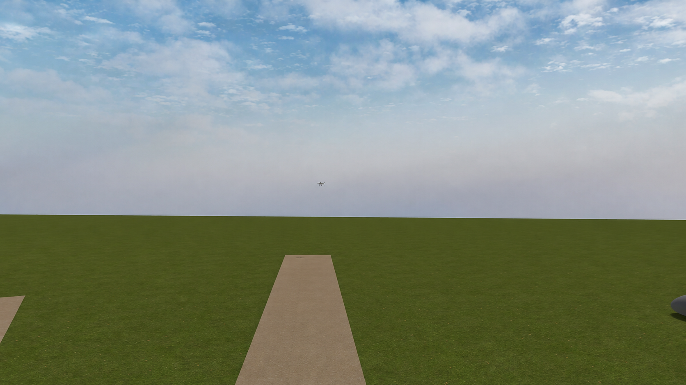

# AeroIntercept

### 基于视觉学习的无人机非接触会合仿真平台

<div align="center">

[](https://gazebosim.org/)
[](https://px4.io/)
[](https://docs.ros.org/en/humble/)
[](https://pytorch.org/)

</div>

> AeroIntercept 在 Gazebo 与 PX4 的闭环仿真中训练视觉控制策略。
> Actor 使用连续两帧机载 RGB 图像和飞控自身速度、角速度，输出三维速度与偏航角速度指令。

---

## 项目简介

当前任务从两机中心距约 **10 m** 开始，以机体 `base_link` 惯性中心距 **≤0.5 m**、
相对速度 **≤0.5 m/s** 持续 **≥0.3 s** 且无接触作为成功条件。目标真值只用于训练监督、
独立 Critic 和评估，不进入 Actor。训练轨迹包含圆周、正弦和随机游走；
`figure_eight`、`stop_go` 用于留出场景检查。

**当前自主策略尚未通过验收。** 已完成闭环评估的远端 BC 基线为 **0/10**。
500 轮追加 BC 已启动，离线损失下降尚不能说明闭环成功；最新有据可查的结论见
[实验记录](assets/docs/EXPERIMENTS.md)。

## 仿真画面

<div align="center">
  
  <p><i>早期 30 m 配置的机载相机截图，仅展示场景；当前任务与验收使用 10 m 初始中心距。</i></p>
</div>

仿真使用两架 PX4 x500 无人机、机载相机和 Gazebo 公园场景。每回合开始时让拦截机
朝向目标；策略接管后由自身观测生成控制指令。

## 系统能力

| 组成 | 当前实现 |
|---|---|
| 视觉策略 | ResNet-18 多尺度编码、空间注意力、双帧 Transformer 与自身状态融合 |
| 飞行控制 | PX4 Offboard 三维速度与偏航角速度控制 |
| 学习方法 | 专家数据行为克隆、非对称 Actor-Critic PPO 与辅助监督 |
| 目标运动 | `circle`、`sinusoidal`、`random_walk`；留出 `figure_eight`、`stop_go` |
| 验证环境 | Gazebo/PX4 物理闭环；轻量二维环境用于算法回归 |

[查看模型架构图](assets/docs/figures/current_model_architecture.png) ·
[SVG 矢量版](assets/docs/figures/current_model_architecture.svg)

## 快速开始

在工程根目录执行。完整仿真需要 Gazebo Harmonic、PX4 SITL、ROS 2 Humble 和
`configs/gazebo_feedback.yaml` 中指定的本地依赖。

**1. 启动双机仿真**

```bash
bash aerointercept/gazebo/scripts/launch_gazebo.sh --mode circle --seed 31
```

**2. 查看策略实际接收的相机图像**

另开终端并激活项目的 Python 环境：

```bash
source /opt/anaconda3/etc/profile.d/conda.sh
conda activate AeroIntercept
python -m aerointercept.gazebo.scripts.view_camera --display
```

**3. 运行开发评估**

结束手动启动的本项目仿真，再让评估程序启动独立仿真。下面的五模式各 2 回合只用于开发比较：

```bash
python -m aerointercept.gazebo.scripts.evaluate \
  --launch --headless --device cuda:0 --suite --episodes 2 --seed 10000 \
  --config configs/gazebo_feedback.yaml \
  --checkpoint artifacts/runs/remote_20260924/best.pt \
  --output artifacts/runs/remote_20260924/recheck/evaluation.json --trace
```

## 工程文件

| 路径 | 内容 |
|---|---|
| `aerointercept/` | 模型、Gazebo/PX4 接口、训练与评估代码 |
| `configs/` | 仿真和模型配置 |
| `assets/` | 场景、模型、材质、文档与架构图 |
| `artifacts/data/` | 可复用数据集 |
| `artifacts/runs/<实验名>/` | 同次实验的权重、日志、评估与导出 |
| `tests/` | 回归测试 |

数据与权重不随 Git 分发。当前数据为 `artifacts/data/noncontact_geometry_corrective/`，
本地保留模型为 `artifacts/runs/remote_20260924/best.pt`。
运行参数和服务器任务查看方式见 [使用指南](assets/docs/GUIDE.md)；
实验结果及正式验收标准见 [实验记录](assets/docs/EXPERIMENTS.md)。
