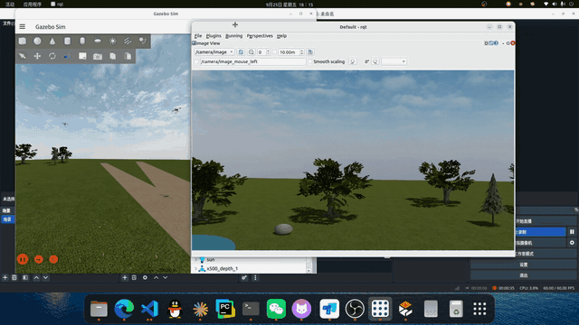
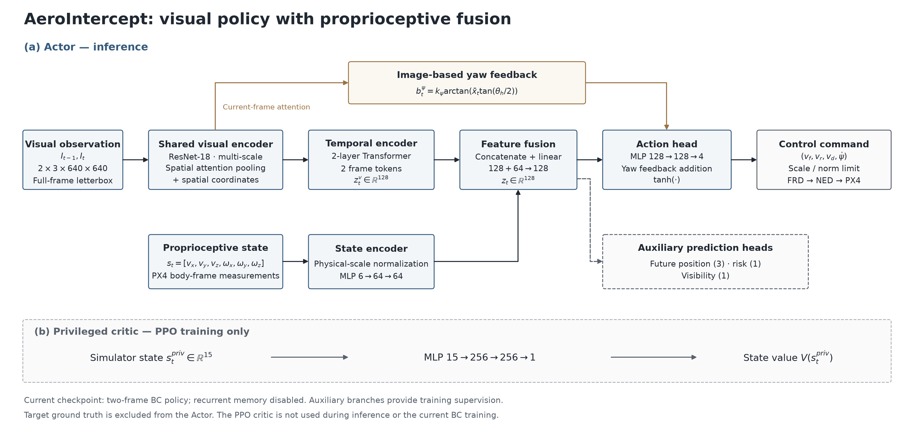

# AeroIntercept

### 面向自主无人机拦截的端到端视觉强化学习与仿真验证平台

<div align="center">

[](https://gazebosim.org/)
[](https://px4.io/)
[](https://docs.ros.org/en/humble/)
[](https://pytorch.org/)


</div>

AeroIntercept 面向移动无人机目标的视觉跟踪与近距离非接触会合研究，将机载视觉策略、
学习算法和 Gazebo/PX4 物理仿真整合为一个可训练、可评估的工程。
策略直接接收连续 RGB 图像与飞控自身状态，输出三维速度和偏航角速度指令。


## 核心特点

- **图像与自身状态融合**：双帧 RGB 提供视觉信息，飞控速度与角速度补充自身运动状态。
- **端到端控制**：ResNet-18 多尺度编码、空间注意力与 Transformer 共同生成动作，无需独立目标检测器。
- **学习与仿真闭环**：提供专家数据采集、行为克隆（BC）、非对称 Actor-Critic PPO 和模型导出入口。
- **多场景验证**：支持圆周、正弦、平滑随机游走、八字及启停运动，区分训练场景与留出场景。

## 效果展示

<div align="center">
  
</div>


## 模型架构



Actor 使用两帧 **640 × 640 RGB** 图像和 **6 维自身状态**（三轴速度、三轴角速度）。
视觉特征经过双帧 Transformer，与自身状态特征融合后生成控制动作；图像注意力提供偏航反馈，
辅助预测头用于训练监督。独立 Critic 仅在 PPO 训练中使用，目标真值不进入 Actor。

[SVG 矢量图](assets/docs/figures/current_model_architecture.svg) ·
[PDF 论文插图](assets/docs/figures/current_model_architecture.pdf) ·
[交互式架构图](assets/docs/figures/current_model_architecture.html)

## 仿真环境

基于 **Gazebo Harmonic + PX4 SITL + ROS 2 Humble**，使用双 x500 无人机、机载相机和公园场景。
PX4 负责底层飞行控制，策略通过 Offboard 接口发送速度指令。

默认任务从约 **10 m** 两机中心距开始，以 **0.5 m** 为会合半径，并检查相对速度、保持时间与接触状态。
目标采用受限合作运动，用于研究视觉策略的跟踪、接近和泛化能力。项目仍处于研究验证阶段。

## 快速体验

先按 [使用指南](assets/docs/GUIDE.md) 配置仿真依赖与 Python 环境，并核对
[主配置](configs/gazebo_feedback.yaml) 中的本机路径。数据和训练权重不随 Git 分发。

在工程根目录激活环境后，使用已有权重启动可视化演示：

```bash
conda activate AeroIntercept

python -m aerointercept.gazebo.scripts.evaluate \
  --launch --device cuda:0 \
  --config configs/gazebo_feedback.yaml \
  --checkpoint artifacts/runs/training/corrective_100_20260925/best.pt \
  --mode stop_go --episodes 4 --seed 10016 \
  --output artifacts/runs/experiments/visual_demo/evaluation.json
```

`--mode` 可切换目标运动类型；添加 `--headless` 可关闭图形界面，按 `Ctrl+C` 停止运行。

## 工程结构

| 目录 | 内容 |
|---|---|
| `aerointercept/` | 策略模型、训练算法、仿真接口与评估工具 |
| `configs/` | 模型、训练与仿真配置 |
| `assets/` | 场景资源、架构图和项目文档 |
| `artifacts/data/` | 本地训练数据集 |
| `artifacts/runs/training/` | 权重、训练日志与离线指标 |
| `artifacts/runs/experiments/` | 闭环评估报告与轨迹 |
| `tests/` | 回归测试 |
