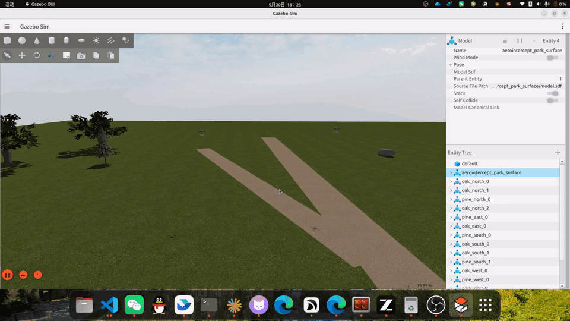
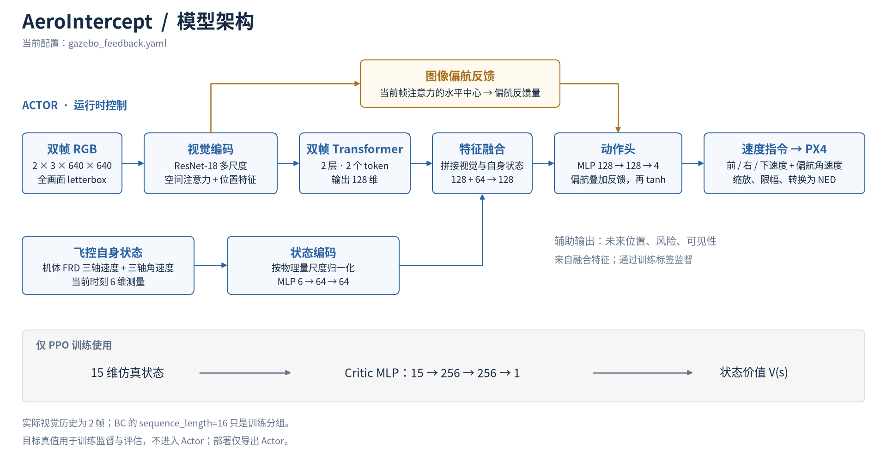

# AeroIntercept

### 面向自主无人机的端到端拦截与仿真验证平台

<div align="center">

[](https://gazebosim.org/)
[](https://px4.io/)
[](https://docs.ros.org/en/humble/)
[](https://pytorch.org/)


</div>

AeroIntercept 面向移动无人机目标的视觉跟踪与接触式拦截研究，将机载视觉策略、
学习算法和 Gazebo/PX4 物理仿真整合为一个可训练、可评估的工程。
策略直接接收连续 RGB 图像与飞控自身状态，输出三维速度和偏航角速度指令。


## 核心特点

- **图像与自身状态融合**：双帧 RGB 提供视觉信息，飞控速度与角速度补充自身运动状态。
- **端到端控制**：ResNet-18 多尺度编码、空间注意力与 Transformer 共同生成动作，无需独立目标检测器。
- **学习与仿真闭环**：提供专家数据采集、行为克隆（BC）、非对称 Actor-Critic PPO 和模型导出入口。
- **多场景验证**：支持圆周、正弦、平滑随机游走、八字及启停运动，区分训练场景与留出场景。

## 效果展示

<div align="center">
  
</div>


## 模型架构



Actor 输入两帧 **640 × 640 RGB** 图像与 **6 维自身状态**（三轴速度、三轴角速度），
经 ResNet-18 多尺度编码与双帧 Transformer 融合后输出控制动作；图像注意力提供偏航反馈，
辅助预测头仅用于训练监督。独立 Critic 仅在 PPO 训练中使用，目标真值不进入 Actor。

## 仿真环境

基于 **Gazebo Harmonic + PX4 SITL + ROS 2 Humble**：公园场景中的双 x500 无人机，
目标机按受限合作运动飞行，拦截机通过 PX4 Offboard 接口执行策略速度指令。
任务从约 **10 m** 两机中心距开始，两机接触或一步内最小中心距 **≤0.5 m** 即为成功。

## 闭环结果

保留权重（五场景纠偏 BC 模型）在五种目标运动、各 4 回合的开发评估中（`contact_intercept_v1`，seed 10000）：

| 目标运动 | 圆周 | 正弦 | 随机游走 | 八字 | 启停 | 整体 |
|---|---|---|---|---|---|---|
| 命中率 | 3/4 | 4/4 | 2/4 | 0/4 | 3/4 | **12/20（60%）** |

成功回合平均 **2.4–3.0 s** 仿真时间即完成接触；失败集中在植被接触、出画与目标丢失，
八字场景仍是当前短板，独立种子复测为 10/20。项目仍处于研究验证阶段，
正式验收标准与逐回合数据见[结果与验收](assets/docs/RESULTS.md)。

## 快速体验

先按 [使用指南](assets/docs/GUIDE.md) 配置仿真依赖与 Python 环境，并核对
[主配置](configs/gazebo_feedback.yaml) 中的本机路径。数据集与训练产物不随 Git 分发，
仓库内的 `assets/models/best.pt` 是随仓库提供的保留权重。

在工程根目录激活环境后，启动可视化演示：

```bash
conda activate AeroIntercept

python -m aerointercept.gazebo.scripts.evaluate \
  --launch --device cuda:0 \
  --config configs/gazebo_feedback.yaml \
  --checkpoint assets/models/best.pt \
  --mode circle --episodes 4 --seed 10016 \
  --output "artifacts/runs/experiments/demo_$(date +%Y%m%d_%H%M%S)/evaluation.json"
```

`--mode` 可选 `circle / sinusoidal / random_walk / figure_eight / stop_go`；
添加 `--headless` 可关闭图形界面，`Ctrl+C` 随时停止运行。

## 工程结构

| 目录 | 内容 |
|---|---|
| `aerointercept/` | 策略模型、训练算法、仿真接口与评估工具 |
| `configs/` | 模型、训练与仿真配置 |
| `assets/` | 场景资源、架构图和项目文档 |
| `tests/` | 回归测试 |

本地 `artifacts/` 存放数据集、训练权重与评估报告（不随 Git 分发）。
训练结果、闭环评估与正式验收标准见[结果与验收](assets/docs/RESULTS.md)。
